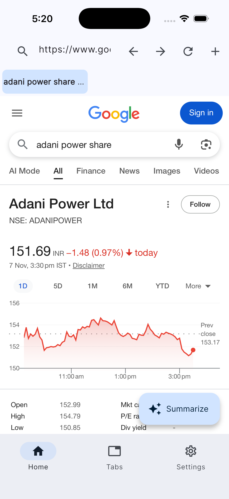
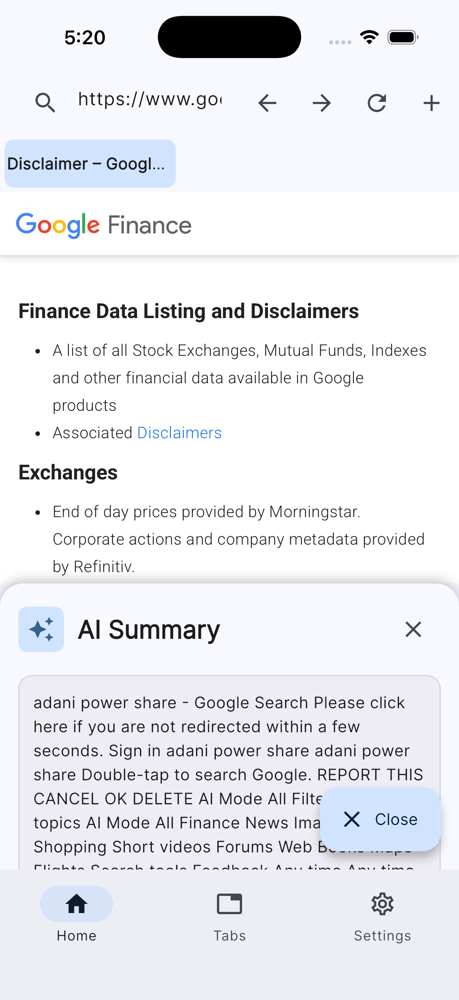
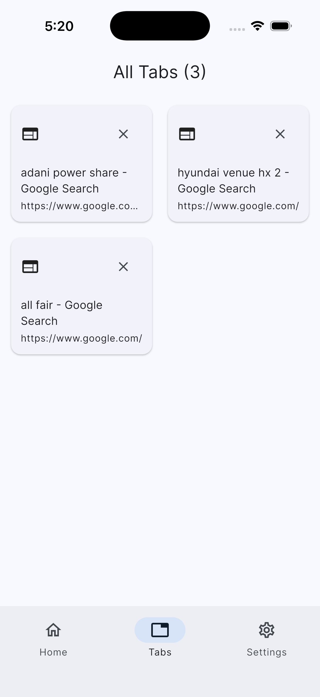
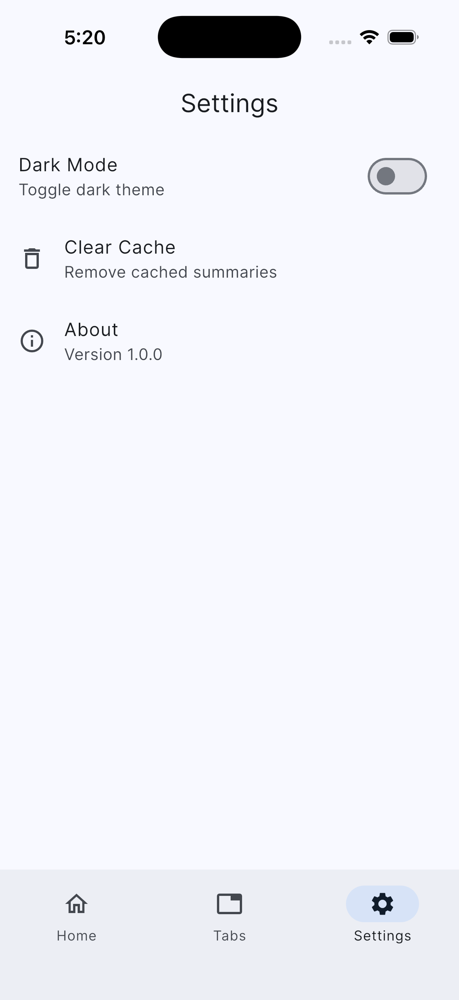

# 🧭 Mini Cross-Platform In-App Browser with AI Summary Widget

  
  
  
  

A production-ready **Flutter application** featuring a **multi-tab browser** with **AI-powered content summarization**, **offline caching**, and **cross-platform** support.

---

## 📋 Table of Contents

- [Features](#-features)
- [Architecture](#-architecture)
- [Tech Stack](#-tech-stack)
- [Setup Instructions](#-setup-instructions)
- [Project Structure](#-project-structure)
- [Design Decisions](#-design-decisions)
- [API Documentation](#-api-documentation)
- [Performance Optimization](#-performance-optimization)
- [Known Issues](#-known-issues)
- [Future Improvements](#-future-improvements)

---

## ✨ Features

### 🧩 Core Features

✅ **Multi-Tab Browser:** Support for multiple concurrent tabs with smooth switching  
✅ **AI Content Summarization:** Intelligent page summarization with keyword extraction  
✅ **Offline Mode:** Cached summaries persist across sessions  
✅ **Clean Architecture:** Domain/Data/Presentation layer separation  
✅ **State Persistence:** Tabs and data survive app restarts  
✅ **Responsive UI:** Works seamlessly on mobile and web  

### 🚀 Advanced Features

🌙 **Dark/Light Mode Toggle**  
🔖 **Tab Management** with visual grid view  
📊 **Content Analysis** (language detection, keyword extraction)  
💾 **Smart Caching** (7-day cache expiration)  
🎨 **Material Design 3 UI**  
⚡ **Performance Optimized WebView**

---

## 🏗️ Architecture

lib/
├── domain/ # Business Logic Layer
│ └── entities/ # Core business objects
│ ├── browser_tab.dart
│ └── page_summary.dart
│
├── data/ # Data Layer
│ ├── models/ # Data models with Hive adapters
│ │ ├── browser_tab_model.dart
│ │ └── page_summary_model.dart
│ ├── repositories/ # Repository implementations
│ │ └── browser_repository_impl.dart
│ └── services/ # External services
│ └── ai_summary_service.dart
│
└── presentation/ # UI Layer
├── providers/ # Riverpod state management
│ └── browser_providers.dart
├── pages/ # UI screens
│ ├── browser_home_page.dart
│ ├── browser_view.dart
│ ├── tabs_view.dart
│ └── settings_view.dart
└── widgets/ # Reusable components

### 🧱 Architecture Diagram

┌─────────────────────────────────────────────────────┐
│ Presentation Layer │
│ ┌────────────┐ ┌────────────┐ ┌────────────┐ │
│ │ Browser │ │ Tabs │ │ Settings │ │
│ │ View │ │ View │ │ View │ │
│ └─────┬──────┘ └─────┬──────┘ └─────┬──────┘ │
│ │ │ │ │
│ └────────────────┴────────────────┘ │
│ │ │
│ Riverpod Providers │
│ ┌─────────────────────┴─────────────────────────┐ │
│ │ TabStateNotifier │ SummaryNotifier │ │
│ └─────────────────────┬─────────────────────────┘ │
└────────────────────────┼──────────────────────────┘
│
┌────────────────────────┼──────────────────────────┐
│ Data Layer │
│ ┌──────────────────────────────────────────────┐ │
│ │ BrowserRepositoryImpl │ │
│ │ ┌──────────────┐ ┌──────────────┐ │ │
│ │ │ Hive Box │ │ AI Service │ │ │
│ │ │ (Tabs) │ │ (Summary) │ │ │
│ │ └──────────────┘ └──────────────┘ │ │
│ └──────────────────────────────────────────────┘ │
└─────────────────────────────────────────────────────┘
│
┌────────────────────────┼──────────────────────────┐
│ Domain Layer │
│ ┌──────────────┐ ┌──────────────┐ │
│ │ BrowserTab │ │ PageSummary │ │
│ │ (Entity) │ │ (Entity) │ │
│ └──────────────┘ └──────────────┘ │
└─────────────────────────────────────────────────────┘

## 🛠️ Tech Stack

| **Category** | **Technology** | **Purpose** |
|---------------|----------------|--------------|
| **Framework** | Flutter 3.x | Cross-platform development |
| **State Management** | Provider 6.1+ | Simplified dependency injection and state management |
| **WebView** | flutter_inappwebview | Advanced WebView features |
| **Storage** | Hive 2.2+ | Fast NoSQL local database |
| **Networking** | Dio 5.4+ | HTTP client for API calls |
| **UI** | Material 3 | Modern design system |
| **Fonts** | Google Fonts | Custom typography |
| **Utilities** | UUID, Intl | ID generation and formatting |
| **AI Integration** | SMMRY / Custom API | Content summarization |
| **Architecture** | Clean Architecture | Domain-driven, layered separation |